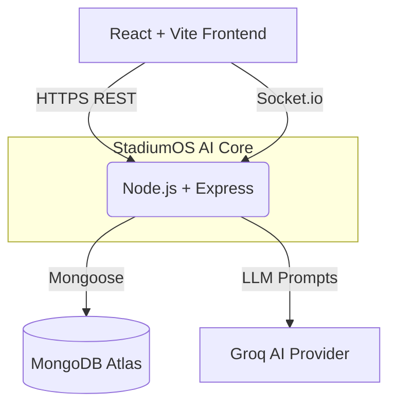

<div align="center">
  
  
  <h1>🏟️ StadiumOS AI</h1>
  <p><strong>The Intelligent Engine for Next-Generation Venue Management</strong></p>

  <p>
    <a href="#-problem-statement">Problem Statement</a> •
    <a href="#-solution">Solution</a> •
    <a href="#-key-features">Key Features</a> •
    <a href="#%EF%B8%8F-architecture">Architecture</a> •
    <a href="#-tech-stack">Tech Stack</a> •
    <a href="#-demo-credentials">Demo Credentials</a>
  </p>
</div>

---

## 🚨 Problem Statement
Modern mega-stadiums and massive live events face critical operational bottlenecks:
1. **Siloed Data**: Crowd control, ticketing, incident management, and volunteer dispatching are run on completely disjointed systems.
2. **Reactive, Not Proactive**: Operations centers react to emergencies *after* they happen instead of predicting congestion points in real-time.
3. **Communication Delays**: When a medical emergency occurs, dispatching the right volunteer and broadcasting safe exit routes to fans takes too long, putting lives at risk.

## 💡 Solution
**StadiumOS AI** is a unified, AI-powered real-time command center. 

By integrating Live Digital Twins, Predictive Crowd Intelligence (Groq Llama 3), and bi-directional WebSocket communication, StadiumOS AI allows organizers to proactively manage stadium health, auto-dispatch volunteers to incidents, and generate instant executive reports—all from a single pane of glass.

---

## ✨ Key Features

### 🏢 For Organizers & Admins
- **Live Digital Twin**: Real-time interactive map showing crowd density, incidents, and volunteer locations.
- **Match Operations Center**: A live command center that orchestrates the entire event lifecycle.
- **Predictive Crowd AI**: Analyzes live density and automatically recommends flow redirection strategies to prevent stampedes.
- **AI Command Center**: NLP interface to instantly generate tasks, find volunteers, and create incidents using natural language.
- **Executive Reporting**: One-click, AI-generated post-match analysis aggregating all incidents, crowd metrics, and volunteer performance.
- **System Health Dashboard**: Full technical observability of the underlying infrastructure (API, DB, Socket, AI performance).

### 🏃 For Volunteers
- **Live Task Dispatch**: Real-time task assignment via Socket.io.
- **Incident Reporting**: Instantly report issues from the field with precise coordinates.
- **Performance Tracking**: Track completion times and efficiency.

### 🎫 For Fans
- **Smart Navigation**: AI-powered dynamic routing avoiding highly congested zones.
- **Emergency Protocols**: Instant override of the fan app during emergencies with safe evacuation routes.
- **Live Assistance**: Multi-lingual AI assistant for ticketing, parking, and stadium queries.

---

## 🏗️ Architecture

StadiumOS AI is built on a highly decoupled, real-time microservices-inspired architecture:



### 🧠 The Intelligence Layer (Groq AI)
We leverage **Groq's Llama 3 models** for ultra-fast inference. Our `aiOrchestrator` periodically analyzes live crowd metrics and automatically triggers the Emergency Broadcast System if thresholds are exceeded.

### ⚡ The Real-Time Engine (Socket.io)
Polling is dead. Every incident created, task assigned, and crowd density shift is broadcasted instantaneously via targeted WebSocket rooms (`match:123`, `role:Organizer`, `user:456`).

---

## 💻 Tech Stack

- **Frontend**: React 18, Vite, TailwindCSS v4, Lucide Icons, Recharts, Leaflet
- **Backend**: Node.js, Express.js, Socket.io
- **Database**: MongoDB (Mongoose ODM)
- **AI Engine**: Groq SDK (Llama 3.1 8B Instant)
- **Security**: JWT, Helmet, Express Rate Limiter, HTTP-Only Cookies
- **Deployment**: Vercel (Frontend), Render (Backend)

---

## 🚀 Installation & Local Development

### Prerequisites
- Node.js (v18+)
- MongoDB (Local or Atlas)
- Groq API Key

### 1. Clone the Repository
```bash
git clone https://github.com/your-username/stadiumos-ai.git
cd stadiumos-ai
```

### 2. Backend Setup
```bash
cd server
npm install
cp .env.example .env
# Edit .env with your MongoDB URI and Groq API Key
npm run seed  # Populate demo database
npm start     # Run the backend
```

### 3. Frontend Setup
```bash
cd client
npm install
cp .env.example .env
# Edit .env to point to backend (default: http://localhost:5000/api/v1)
npm run dev
```

---

## 🔑 Demo Credentials

To fully experience the live synchronization, open multiple incognito windows and log in with different roles:

| Role | Email | Password | Access Level |
|------|-------|----------|--------------|
| **Enterprise Admin** | `admin@demo.com` | `password123` | Full System & Technical Settings |
| **Match Organizer** | `organizer@demo.com` | `password123` | Live Operations & Digital Twin |
| **Ground Volunteer** | `volunteer@demo.com` | `password123` | Task Execution & Reporting |
| **General Fan** | `fan@demo.com` | `password123` | Navigation & Ticketing |

*(These are intentional demo accounts safely pre-seeded in the database for hackathon judges.)*

---

## 🔮 Future Scope
- **IoT Integration**: Hardware integration for real-time turnstile data instead of simulated metrics.
- **Computer Vision**: Camera feeds piped directly into the Groq LMM for visual anomaly detection.
- **Push Notifications**: PWA integration for native mobile push alerts during critical emergencies.

---
<div align="center">
  <i>Built with ❤️ for the Hackathon</i>
</div>
