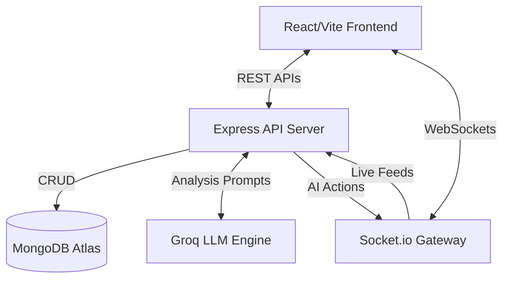

# 🏗️ StadiumOS AI Architecture

## High-Level Architecture Diagram

## Core Modules & Phases

### 1. Enterprise Admin & System Monitoring (Phases 1 & 8)
- A global governance layer that oversees the technical health (API latency, AI performance, WebSocket connections) and user roles.
- The `SystemHealthDashboard` polls metrics collected via `requestMetricsMiddleware` and `auditMiddleware`.

### 2. Smart Notification & Emergency Broadcast System (Phases 2 & 3)
- Real-time `Socket.io` connectivity enables targeted alerts. Organizers can trigger an Emergency Broadcast that overrides Fan and Volunteer interfaces instantly with safe evacuation routes and critical instructions.

### 3. Match Operations Center & Digital Twin (Phase 7)
- The heart of the platform. Organizers monitor the entire stadium using an interactive Leaflet map that renders live crowd density heatmaps, active incident markers, and real-time volunteer positions.

### 4. Advanced Analytics & Volunteer Performance (Phases 4 & 5)
- Tracks live operational KPIs (ticket scans, parking, crowd flow).
- The Volunteer Performance Center tracks resolution times and efficiency metrics, creating a complete feedback loop for ground staff.

### 5. AI Intelligence Layer & Executive Reports (Phases 6 & 9)
- **AI Command Center**: Uses NLP to translate user instructions into actionable tasks and incidents.
- **AI Orchestrator**: Runs in the background, analyzing crowd density spikes and auto-suggesting redirection strategies to prevent bottlenecks.
- **Executive Reporting**: Aggregates the entire event timeline (incidents, tasks, crowd metrics) into a cohesive, AI-generated post-match summary for stakeholders.

### 6. Production DevOps (Phase 9)
- Hardened security with Helmet, Express Rate Limit, and strict cross-domain HTTP-only JWT cookies.
- React Router wrapped in `<Suspense>` with `React.lazy()` for massive performance gains on initial load.
- Designed for seamless serverless deployment (Vercel) and web service execution (Render).
